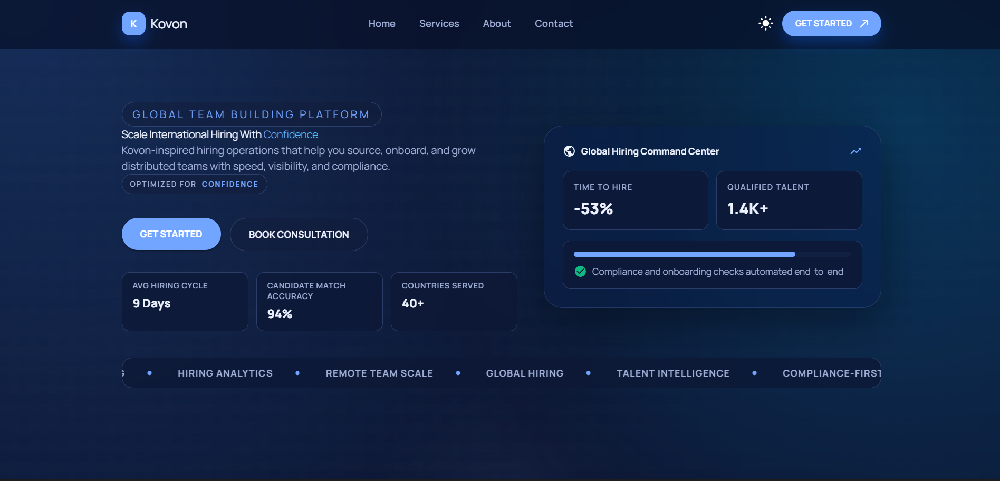
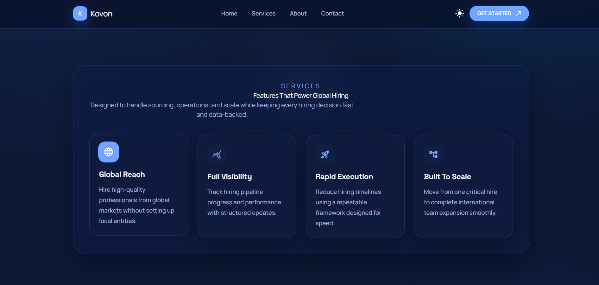

#  Kovon Website Replica

A modern and responsive landing page replica built using **Next.js (App Router)**, **TypeScript**, and **Tailwind CSS**.

🔗 **GitHub Repository:**  
https://github.com/Vasu996/kovon-website-replica

---

## 🌐 Live Demo

https://kovon-website-replica.vercel.app/


---

## ✨ Features

- ✅ Fully Responsive Design  
- ✅ Built with Next.js App Router  
- ✅ TypeScript for type safety  
- ✅ Tailwind CSS styling  
- ✅ Clean and modular component structure  
- ✅ Reusable UI components  
- ✅ Organized folder structure  
- ✅ Production-ready setup  

---

## 📸 Screenshots

### 🏠 Homepage


### 🧩 Services Section


---

## 🛠️ Tech Stack

- Next.js 14+
- React
- TypeScript
- Tailwind CSS
---

## 📁 Project Structure
```
kovon-website-replica/
│
├── app/ # Next.js App Router
│ ├── globals.css # Global styles
│ ├── layout.tsx # Root layout
│ ├── page.tsx # Home page
│ └── theme-provider.tsx # Theme provider
│
├── components/ # Reusable UI components
│ ├── header/ # Header component
│ ├── hero/ # Hero section
│ ├── features/ # Features section
│ ├── how-it-works/ # How it works section
│ └── footer/ # Footer component
│
├── constants/ # Static content & data
├── types/ # TypeScript type definitions
│
├── public/
│ └── images/ # Screenshots & static assets
│
├── next.config.mjs # Next.js configuration
├── tailwind.config.ts # Tailwind CSS configuration
├── postcss.config.js # PostCSS configuration
├── tsconfig.json # TypeScript configuration
├── package.json # Dependencies & scripts
├── .gitignore # Git ignored files
└── README.md # Project documentation

```
# 📥 How to Clone the Project

### 1️⃣ Clone Repository

```bash
git clone https://github.com/Vasu996/kovon-website-replica.git

cd kovon-website-replica

npm install

npm run dev

i want this as readme without error
